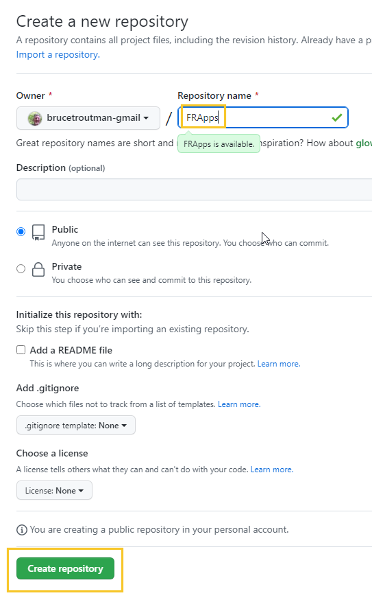
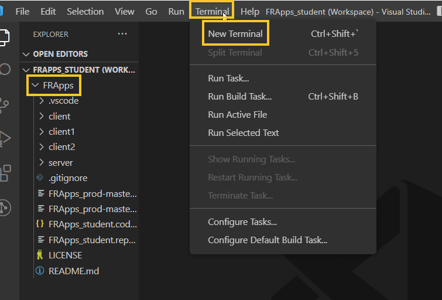
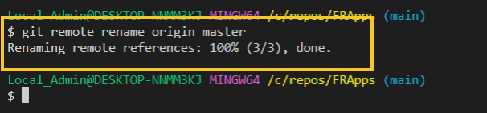
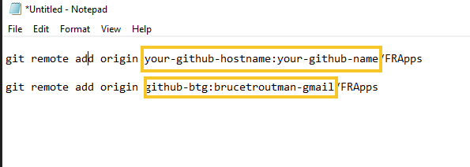
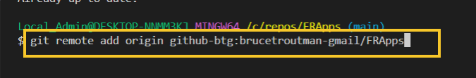
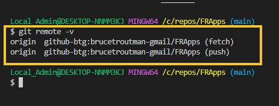
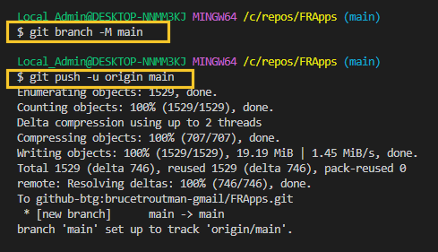

<!-- ------------------------------------------------------------------------- -->

<div class="page-back">

[BACK - Website SSL](/Setup/fr0306_Setup-Website-SSL-Ubuntu.md)
</div><div class="page-next">

[My HTML Custom - NEXT](/FRApps/fr020100_My-HTML-Custom.md)
</div><div style="margin-top:35px">&nbsp;</div> 
 
<!-- ------------------------------------------------------------------------- -->

## 3.1 Clone FRApps 0:45 <!-- {docsify-ignore} -->
<div class="notice-tip">
  <div class="notice-tip-header">
    Tip: <a href="../Setup/purposes/pfr0200_Clone-FR-Apps.md" target="_blank">Link to Background and Purposes</a> 
  </div>  
</div>

<div class="notice-tip">
  <div class="notice-tip-header">
    Tip: <a href="https://discord.com/channels/928752444316483585/931216956827250709" target="_blank">Link to Discord for Your Comments</a> 
  </div>  
</div>

#### Introduction <!-- {docsify-ignore} -->  
- FRApps is a collection of applications. The apps increase in complexity from simple through database access. 
- In this topic you will clone and test these basic applications on your local workstation.


<details class="details-style">
    <summary class="summary-style">
More Info: Names, Caps, Picts, Code Copy
    </summary>
    <div class="popup">

- In this tutorial please be careful to use the Exact Spelling and Capitalization. You will be using Windows, Unix and GitBash command prompts. Improper captialization will cause commands to fail. Some examples are: Local_Admin, myProject, repos, remotes and .ssh.

- This documentation was produced in 2021-2022. You will experience differences in some of the pictures due to the changes made over time by the developers of the softwares and web sites that are used.

- We recommend that you copy and paste code snippets from the documentation into your workstation/server. This will reduce the errors caused by hand typing.
Hover over the snippet and click copy, then paste as appropriate.

</div>
</details>


----


### 1 Clone FRApps Repository 0:05
----
#### 1. Clone into the local repos folder using the Windows Command prompt


```
cd C:/repos
```
 


```
git clone https://github.com/8020data/FRApps_prod-master.git FRApps
```
```
cd FRApps
```
```
dir
```


#### 2. Enter the following in the Windows command window. (It will open VSCode)

```
code FRApps.code-workspace
```

- If prompted, click "Yes I trust the authors".


 
#### 3. Create FRApps in your github. 

- Browse to and login to your personal github account. (We created this in Step 1.1.5)

- Use Notepad to change your-github-name  e.g. brucetroutman-gmail

- Be sure that you are "signed in" to your github account

```
https://github.com/your-github-name?tab=repositories
```


then click the New green button (if you are not signed in the New button will not appear)


- Enter FRApps as a new repository 

- Click the Create Repository green button




#### 4. Using VSCode connect your local FRApps to your personal github FRApps

- Click on FRApps and then click Terminal (or the three dots if Terminal is not visible), then click New Terminal, then 



- Show your current remotes: 8020data

```
git remote -v
```


- Remove this remote from "origin"

```
git remote remove origin
```



- Change your remote to your personal github. 

- Use Notepad to change your=github-hostname below to your host. e.g. github-btg
 (Your github host is found in the config file in the .ssh folder)


- then, change your-github-name below to your github name. e.g brucetroutman-gmail


```
git remote add origin your-github-hostname:your-github-name/FRApps
```





- Confirm that your remotes have changed

```
git remote -v
```




#### 6.  Push from your local FRApps repo to personal github FRApps 

```
git branch -M main
```
```
git push -u origin main
```




#### 7. Confirm the transfer to your github FRApps repo

- Refresh your browser.


----


----
<div class="notice-success">
  <div class="notice-success-header">
    Congratulations! You have cloned FRApps successfully to your local workstation.
</div>
</div>

----

<!-- ------------------------------------------------------------------------- -->

<div class="page-back">

[BACK - Website SSL](/Setup/fr0306_Setup-Website-SSL-Ubuntu.md)
</div><div class="page-next">


[My HTML Custom - NEXT](/FRApps/fr020100_My-HTML-Custom.md)
</div>

<!-- ------------------------------------------------------------------------- -->
