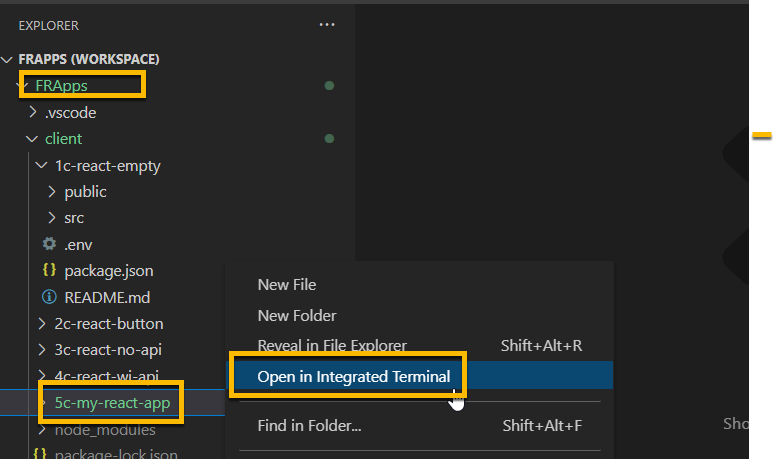

<!-- ------------------------------------------------------------------------- -->

<div class="page-back">


[Back - Website SSL](/Setup/fr0306_Setup-Website-SSL-Ubuntu.md)
</div><div class="page-next disabled">

NEXT
</div><div style="margin-top:35px">&nbsp;</div>

<!-- ------------------------------------------------------------------------- -->

## 3.1 Deploy My React App :45 
- [Purpose and Background](../Setup/purposes/pfr0307_Setup-React-Apps-Ubuntu.md)
- [Enter Comments in Discord](https://discord.com/channels/928752444316483585/932678480863305770)

#### Introduction


#### Important note about names, capitalization and pictures
- In this tutorial please be careful to use the Exact Spelling and Capitalization. You will be using Windows, Unix and GitBash command prompts. Improper captialization will cause commands to fail. Some examples are: Local_Admin, myProject, repos, remotes and .ssh.
- This documentation was produced in 2021-2022. You will experience differences in some of the pictures due to the changes made over time by the developers of the softwares and web sites that are used.

----
### 1. Run 5c-my-react-app  0:05
----
1. From File Explorer navigate to:

```
C repos FRApps
```
- double click on FRApps.code-workspace to open VSCode


2. Right click on the client/5c-my-react-app folder, then
click Open in Integrated Terminal, then 

 

- Enter:

```
npm start
```


- If you are prompted, click Allow Access


----
### 2. Build 5c-my-react-app  0:05
----
1. Right click on the client/5c-my-react-app folder
2. Click Open in Integrated Terminal, then 

 

```
npm run build
```


3. View the build folder


----
### 3. Test Production Build 5c-my-react-app  0:05
----
1. Right click on the client/5c-my-react-app folder
2. Click Open in Integrated Terminal, then 

 

```
npm run prod
```


----
### 4. Deploy Production Build to Remote Server 5c-my-react-app  0:05
----
1. Right click on the client/5c-my-react-app folder
2. Click Open in Integrated Terminal, then 

 

```
npm run deploy
```


3. Confirm that the build folder was transferred

- Login to your remote server using Bitvse and open new SFTP window


- Navigate to

```
/webs/FRApps/client/5c-my-react-app/build
```


### 5. Configure your remote server to run my-react-app

- !!! Not Ready yet !!!


----
#### Congratulations! You have deployed and run the my-react-app successfully on your remote server.
----


<!-- ------------------------------------------------------------------------- -->

<div class="page-back">

[Back - Website SSL](/Setup/fr0306_Setup-Website-SSL-Ubuntu.md)
</div><div class="page-next disabled">

NEXT
</div>

<!-- ------------------------------------------------------------------------- -->