<!-- ------------------------------------------------------------------------- -->

<div class="page-back">

[BACK - formR Introduction](/_home.md.md)
</div><div class="page-next">

[Test NodeJS- NEXT](/Setup/fr0102_Test-Node.md)
</div><div style="margin-top:35px">&nbsp;</div>

<!-- ------------------------------------------------------------------------- -->

## 1.1 Build Workstation 2:30 <!-- {docsify-ignore} -->
<div class="notice-tip">
  <div class="notice-tip-header">
    Tip: <a href="../Setup/purposes/pfr0101_Setup-Developer-Workstation.md" target="_blank">Link to Background and Purposes</a> 
  </div>  
</div>

<div class="notice-tip">
  <div class="notice-tip-header">
    Tip: <a href="https://discord.com/channels/928752444316483585/932678480863305770" target="_blank">Link to Discord for Your Comments</a> 
  </div>  
</div>

#### Introduction <!-- {docsify-ignore} -->
- The following steps create the development environment on your workstation for developing an MERN stack (MySql, Express, React and Node) application. 

- You will access a repository on github and modify it, run it and push changes back to github. We will be using an empty 'Windows Pro N' VM in these instructions. You should be able to use any Windows 10 or above workstation. Just follow the steps. The total disk space required is about 6          GB.

<details class="notice-info">
    <summary class="notice-info-header">
More Info: Names, Caps, Picts, Code Copy
    </summary>
    <div class="notice-info-popup">

- In this tutorial please be careful to use the Exact Spelling and Capitalization. You will be using Windows, Unix and GitBash command prompts. Improper captialization will cause commands to fail. Some examples are: Local_Admin, myProject, repos, remotes and .ssh.

- This documentation was produced in 2021-2022. You will experience differences in some of the pictures due to the changes made over time by the developers of the softwares and web sites that are used.

- We recommend that you copy and paste code snippets from the documentation into your workstation/server. This will reduce the errors caused by hand typing.
Hover over the snippet and click copy, then paste as appropriate.

</div>
</details>

----
### 1. Create a new user, Local_Admin, on your workstation. 0:10
----

<div class="notice-warning">
  <div class="notice-warning-header">
    Warning: Use the Account Name: Local_Admin
  </div>

- It is not recommended to use another account name.

- This account name will be referenced throughout the tutorial.

- If you choose another account name, it cannot contain spaces in the name. This tutorial will fail, if spaces are found in the Windows user account name.

</div>

#### 1. Login to your Windows account
<br/>


#### 2. Search for Control Panel
<br/>


#### 3. Click User Accounts
<br/>

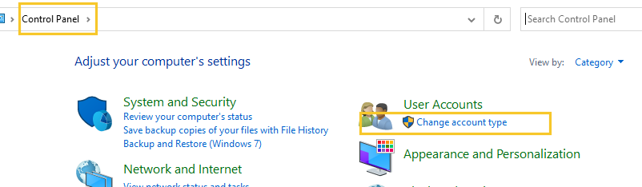

#### 4. Click Add New User...
<br/>


#### 5. Click the (+) Add someone else...
<br/>


#### 6. Click I don't have this person's...
<br/>


#### 7. Click Add a user without a Microsoft account
<br/>


#### 8. Create a user by filling in the information for:
<br/>

- User name:
``` 
Local_Admin
```
- Password:
```
FormR!1234
```

- Select the secret questions and answers to complete the form.


#### 9. Go to Control Panel -> User Accounts -> Change Account Type and select the Local_Admin account
<br/>


#### 10. Click Change Account Type
<br/>


#### 11. Click Administrator radio button and then the Change Account Type button
<br/>


#### 12. Sign out

- Click the Start charm on the taskbar
- then click your login name 
- then click Sign out


#### 13. Sign in as Local_Admin


----
### 2. Install any updates to your workstation.0:05
----


----
### 3. Create new folders, change View Options, setup ssh and create keys 0:15
----
#### 1. In C:\, add folder: repos 

- The repos folder has local copies of your gitHub repositories files

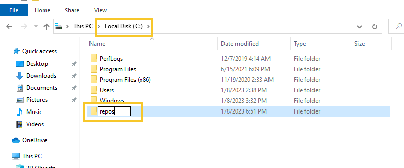

#### 2. In C:\users\Local_Admin\, add folder: .ssh 

- The .ssh folder holds your ssh key related files


#### 3. Change View Options in File Explorer

- Enable Extentions and Hidden Files


#### 4. Test if OpenSSH client is installed.

- From DOS command prompt run ssh.


- If .ssh IS installed, skip to step 7.

#### 5.  If OpenSSH client is Not installed

- Install OpenSSH in Apps & Features - Optional Features


#### 6. OpenSSH client at the command prompt enter:

```
ssh
```


#### 7. Create 3 ssh keys. 

<div class="notice-tip">
  <div class="notice-tip-header">
Note:

-  These keys will be used for GitHub, your Cloud Provider and your Remote server.

-  Run from the Windows command prompt.

  </div>  
</div>

<div class="notice-tip">
  <div class="notice-tip-header">Format for all 3 ssh keys:

- ssh-keygen -t rsa -f
"local user folder/.ssh/
key owner name@host name_host user initials_vdate_key"
-C "key owner name@host name_host user initials_vdate"

Example: 

- ssh-keygen -t rsa -f "c:/Users/Local_Admin/.ssh/mickey.mouse@github_mick_v210713_key" -C "mickey.mouse@github_mick_v210713"

- In the following "mickey mouse snippets" change the following to your info:

- "mickey.mouse" to your Key Owner Name i.e. bruce.troutman
- "mick" to your initials i.e. kff or cbt or bill, etc.
-"v210713" to the "v" + current date  YYMMDD

  </div>  
</div>


##### 1. Key pairs for Github:

- Paste the following code into Notepad and modify it to your information:


```
ssh-keygen -t rsa -f "c:/Users/Local_Admin/.ssh/mickey.mouse@github_mick_v210713_key" -C "mickey.mouse@github_mick_v210713"
```

<div class="notice-tip">
  <div class="notice-tip-header">
    Note: Do not enter a passphase, when prompted.
  </div>  
</div>


##### 2. Key pairs for Cloud Provider:

- Paste the following code into Notepad and modify it to your information:

```
ssh-keygen -t rsa -f "c:/Users/Local_Admin/.ssh/mickey.mouse@Vultr_mick_v210713_key" -C "mickey.mouse@Vultr_mick_v210713"
```

<div class="notice-tip">
  <div class="notice-tip-header">
    Note: Do not enter a passphase, when prompted.
  </div>  
</div>


##### 3. Key pairs for access to Remote Server on Cloud Provider:

- Paste the following code into Notepad and modify it to your information:

```
ssh-keygen -t rsa -f "c:/Users/Local_Admin/.ssh/mickey.mouse@Vultr-FormR0_nimda_v210713_key" -C "mickey.mouse@Vultr-FormR0_nimda_v210713"
```

<div class="notice-tip">
  <div class="notice-tip-header">
    Note: Do not enter a passphase, when prompted.
  </div>  
</div>

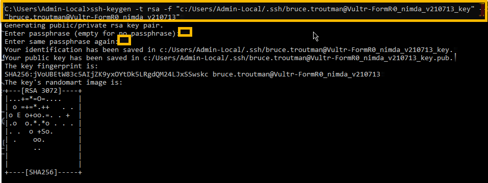

##### 4. View created key files:
<br/>

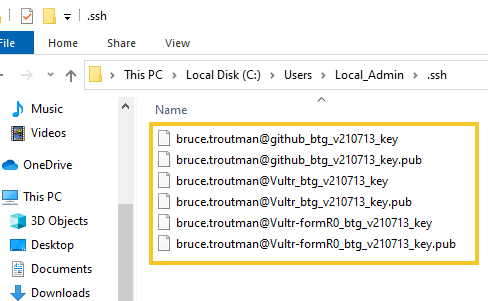

----
### 4. Install or open Chrome browser 0:10
----

- If Chrome is installed, skip to step 2.

#### 1. Download and install Chrome from:

```
https://google.com/chrome
```

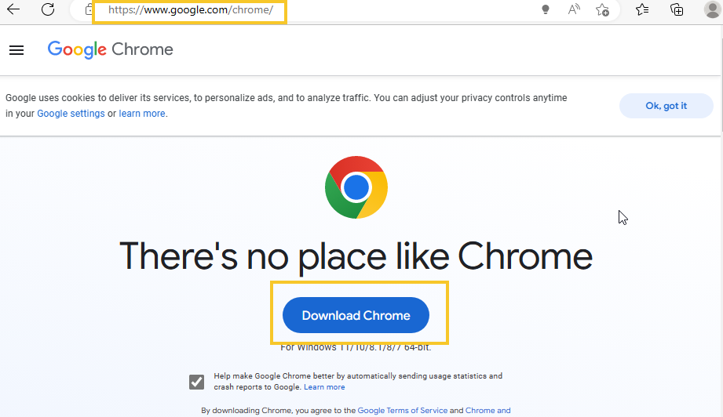

#### 2. Make Chrome your default browser

- Search for "Settings" in the Windows tray, then Apps

<div class="notice-tip">
  <div class="notice-tip-header">
    Note: This only applies to the Local_Admin account.
  </div>  
</div>
<br/>

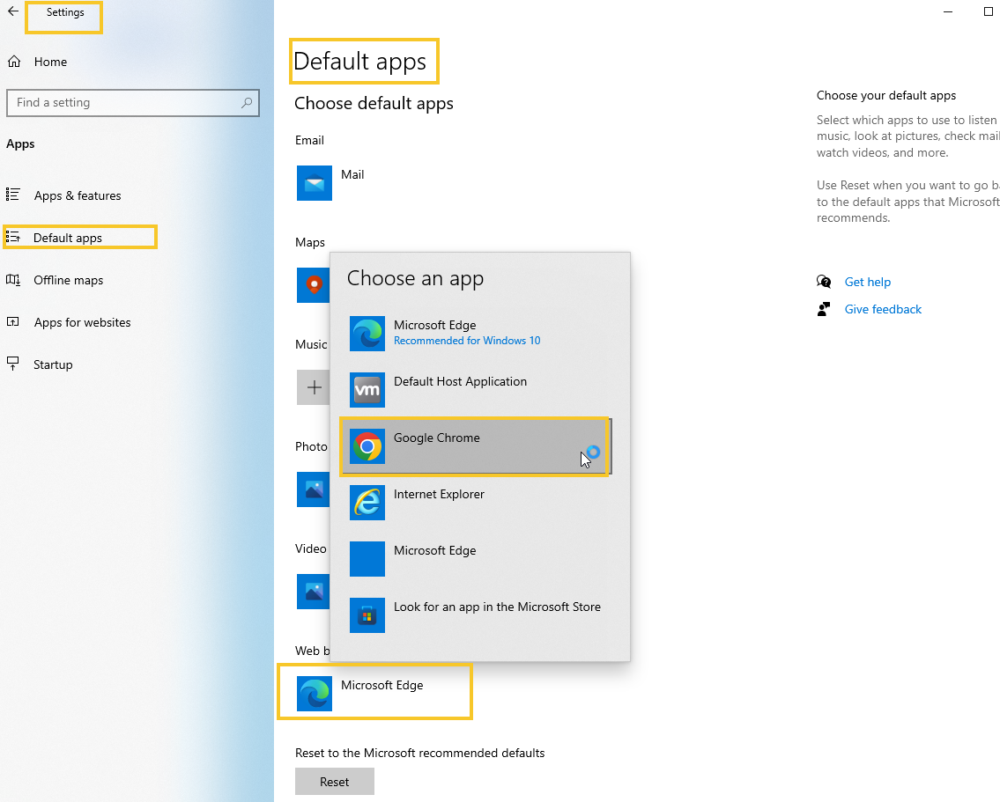


#### 3. Install Chrome Extensions

- These tools will be useful in development.

```
https://chrome.google.com/webstore/category/extensions?hl=en-US
```


#### 4. Add Markdown Preview Plus

- This extension will allow chrome to display Markdown files


#### 5. Allow access to file URLs

- This setting will allow Chrome to view Markdown (.md) files from File Explorer

```
chrome://extensions/?id=febilkbfcbhebfnokafefeacimjdckgl
```


#### 6. Add React Developers Tools

- This extensions adds debugging assistance to Chrome for React applications

```
https://chrome.google.com/webstore/category/extensions?hl=en-US
```


#### 7. Check the installations

<div class="notice-tip">
  <div class="notice-tip-header">
    Note: Google Docs Offline was installed with Chrome.
  </div>  
</div>


```
chrome://extensions/
```

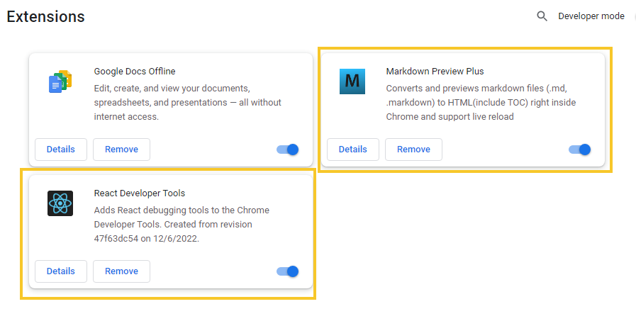

----
### 5. Create Github account or sign in to GitHub then Add your ssh key. 0:15
----
#### 1. Sign in to GitHub. (Create an account, if you don't have one.)

```
https://github.com
```

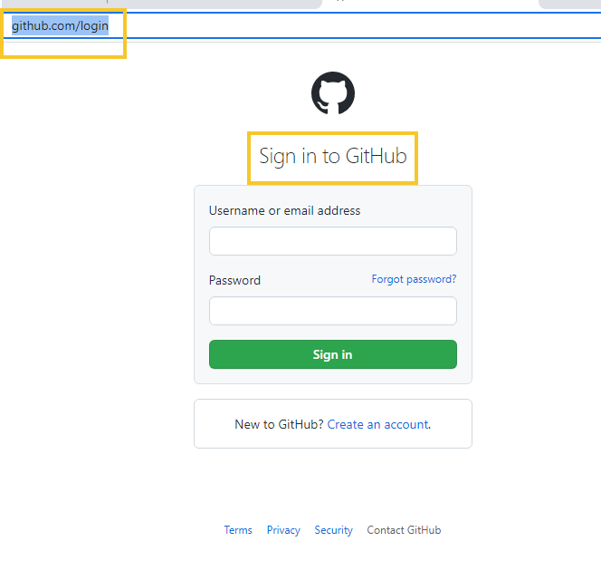

#### 2. Add your Github ssh key from your .ssh folder to your github account.

```
https://github.com/settings/ssh
```

#### 3. Click New SSH Key button


#### 4. In notepad open your github public key from your .ssh folder, then copy the contents to the clipboard.

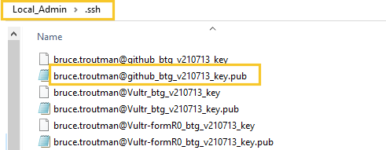

 


#### 5. Paste the clipboard contents into the Key box in the github SSH Keys/ Add someone elseow.

#### 6. Copy the last part of the key and paste it into the Title box.

#### 7. Click the Add SSH key button when finished.


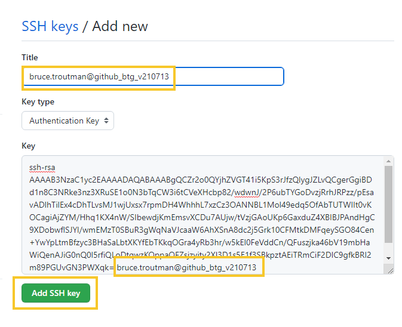


#### 8. Create a new repository: 'myProject'.

```
https://github.com/new
```

#### 9. Add Repository Name "myProject", select Private and check ReadMe file, then click Create Repository.


#### 10. Edit the Readme.md file

- Click the pencil


#### 11. Change file to:

```
# myProject was created on mm/dd/yyyy.
```


#### 12. Commit changes

- Go to the bottom of the edit page to the Commit Changes section.

- A description is required: Update README.md

- Click commit Changes


- Close your browser.

#### 13. Configure ssh Access to Github on your Windows workstation

- Create a Host for github connection in the .ssh/config file.


- Create .ssh/config file in C:/users/Local_Admin/.ssh. Make sure it is saved without the .txt extention, then open with notepad and add the following:

```
Host github-mick
    HostName       github.com
    IdentityFile   C:/Users/Local_Admin/.ssh/mickey.mouse@github_mick_v210713_key
    User           git
```

- Be sure to change:
    - "github-mick"  to "github-(your initials)"
    - IdentityFile to the name of your github key file in C:/Users/Local_Admin/.ssh


#### 14. From the DOS command window, test the connection to github.

- Replace mick with your initials

```
ssh github-mick
```

<div class="notice-tip">
  <div class="notice-tip-header">
    Note: On the first try when prompted enter "yes"
  </div>  
</div>
 


 

- Change directory to repos, connect again and you will be successfully authenticated.

```
ssh github-your initials
```


----
### 6. Download Git, if not already installed 0:10
----

```
 https://git-scm.com/download/win
```


#### 1. Allow changes

 

#### 2. Accept **all the defaults** and install


#### 3. Finish Install check Launch Git Bash


#### 4. Open Git Bash


#### 5. From Git Bash prompt add Username for github

- Change Mickey Mouse to (your name)

```
git config --global user.name = "Mickey Mouse"
```


#### 6. Add User Email for github

- Change mickey.mouse@gmail.com to <your email in github>:    

```
git config --global user.email = "mickey.mouse@gmail.com"
```


#### 7. Add git to System path: 

- Enter env from Windows search charm, then click Edit the System Environment Variables


- Click Environment Variables on System Properties window


-In the System (not user) Variables section click Path and then the Edit button


- Click the New button, then add:

```
C:\Program Files\Git\bin
```


- Then click the OK button and close the next 2 windows

- Close the git bash window

----
### 7. Open or Install VSCode  0:10
----

```
https://code.visualstudio.com/download
```


#### 1. Accept **all the defaults**


#### 2. Pin it to Task Bar


#### 3. Open VSCode and Install Extensions


#### 4. GitLens  -- Supercharged


#### 5. Prettier


#### 6. Live Server

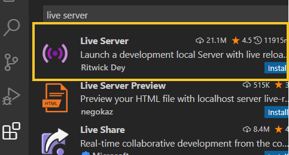

#### 7. React Snippets


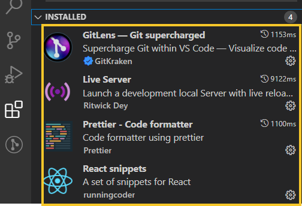

#### 8. Change default terminal and add Autosave

- Using File Explorer create or edit settings.json: 

```
 C:\Users\Local_Admin\AppData\Roaming\Code\User\settings.json
```

- Delete all lines and Add these lines:

```
{
    "files.autoSave": "afterDelay",

    "terminal.integrated.profiles.windows": {
        "Git-Bash": {
        "path": "C:\\Program Files\\Git\\bin\\bash.exe",
        "args": ["-l"]
        }    
    },

    "terminal.integrated.defaultProfile.windows": "Git-Bash",

    "files.associations": {
        "*.njs": "javascript"
    }
}
```
 


#### 9. From VSCode open a new Terminal


- This is your bash terminal

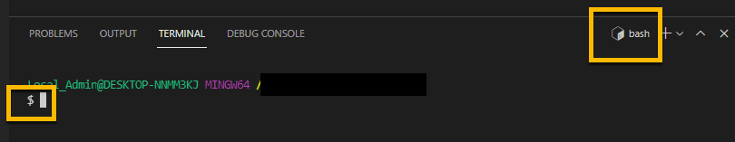

#### 10. Close VSCode

----
### 8. Clone myProject 0:05
----
#### 1. Using File Explorer 

- Navigate to repos folder, right click and select Git Bash here


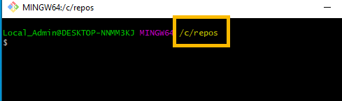

#### 2. Clone myProject from github into the local repos folder

- Change:

    - github-mick to github-(your initials) that you created in step 1.1.3 above

    - mickeymouse to (your github account name)

```
git clone github-mick:mickeymouse/myProject.git
```

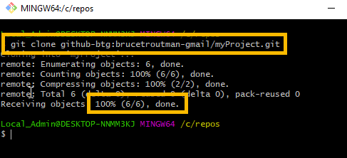

#### 3. Open myProject in VScode

- Remember captialization counts

```
cd myProject
```
```
code .
```


#### 4. Trust the authors


#### 5. Close the Welcome window


#### 6. Click File.. then Save Workspace as: myProject.code-workspace


----
### 9. Markdown Preview test 0:05
----
#### 1.  Open MyProject in VSCode and click on the ReadMe.md file and add these lines:

```
    1. My first update was changed locally.

    #### 2. I previewed it in VSCode and Chrome.
```


#### 2. Click View.. Command Palette and type: >Markdown: Open Preview to the Side, your preview will display.


#### 3. From File Explorer right click on Readme.md then Open With and navigate to Chrome.exe, your preview will display.


----
### 10. From VSCode push and pull with GitHub 0:10
----
#### 1. From VSCode.. Click the Control Source icon with the number of changes. In this case there are 2 files that have been changed.


#### 2. In the Message textbox, type: 

```
Added Workspace and Updated Readme.md
```


#### 3. If this shows then, Select Always at the There are no staged changes... box 

 

#### 4. Click on the Commit checkmark above the Message textbox


#### 5. If this shows then, Select Yes at the Git fetch box


#### 6. Click the Sync Changes button to push to github


#### 7. Login to GitHub and select the myProject repository then click Readme.md, it should be updated.


#### 8. Modify Readme.md in Github by adding these lines:

- Remember the pencil!

```
3. I updated it in GitHub.

4. I pulled it to my local repo using VScode
```


#### 9. Commit changes

- Go to the bottom of the edit page to the Commit Changes section.

- A description is required: 

```
Update README.md added 3. and 4.
```

- Click commit Changes


<<<<<<< Updated upstream
#### 10. Click the Sync Changes button to push to github
=======
#### 8. In VSCode click the Sync charm on the left of the bottom tray to pull from github
>>>>>>> Stashed changes

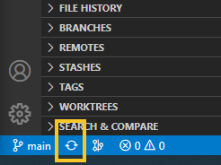

#### 11. The Github changes will now appear in the Readme.md file. 


----
### 11. Install Node Version Selector for Windows 0:05
----
<div class="notice-warning">
  <div class="notice-warning-header">
    Warning: Be sure to CLOSE VSCode before installing NVS
  </div>
</div>

#### 2. To download NVS browse to this URL and click to open the downloaded .msi file: 

```
https://github.com/jasongin/nvs/releases/download/v1.6.0/nvs-1.6.0.msi
```

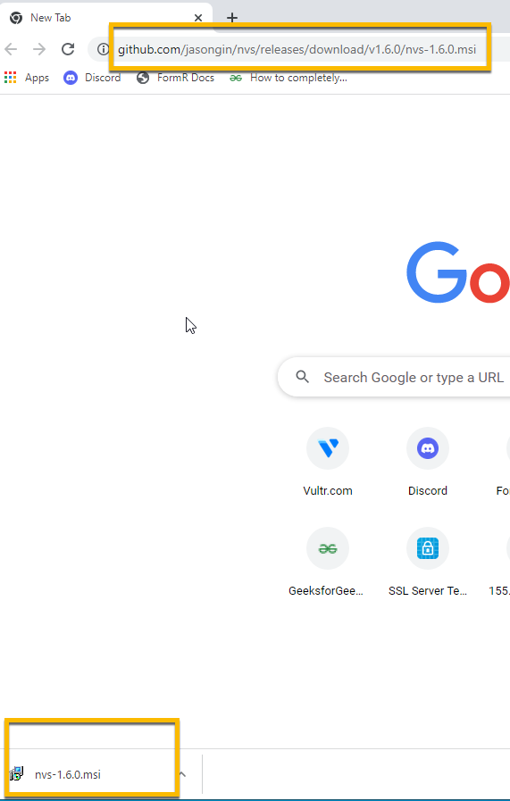

#### 3. From your Downloads folder click the .msi file to Install nvs as follows:

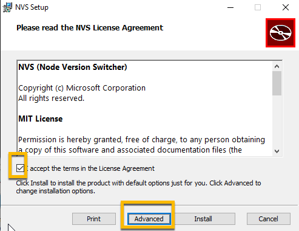

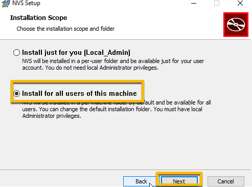

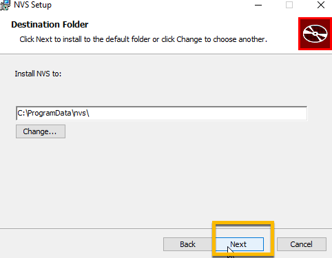

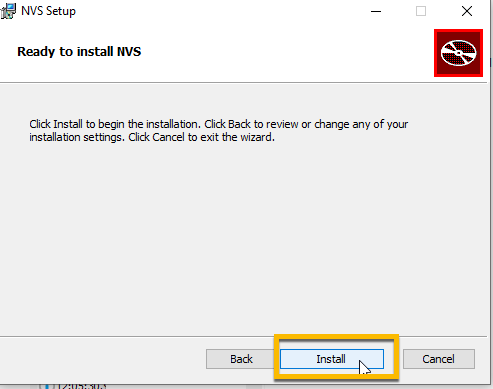

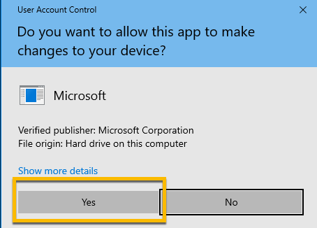

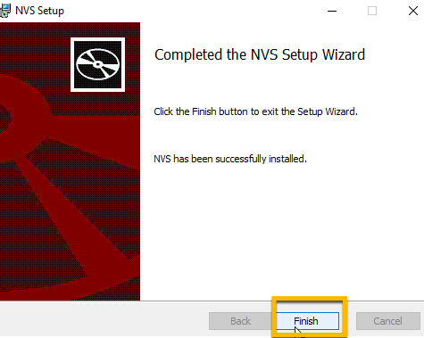

#### 4. Open Windows command as Administrator 

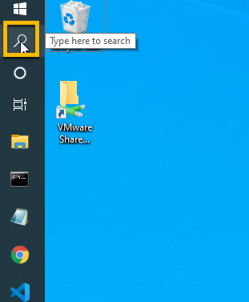

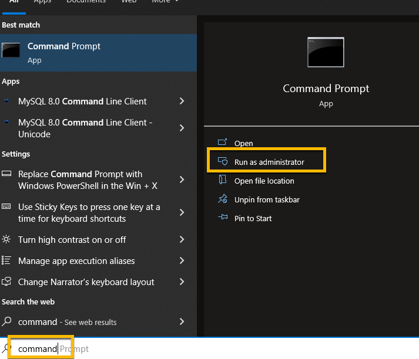

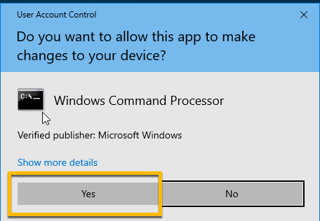

- Choose the latest EVEN numbered release. To see the version list enter:

```
 nvs menu
```

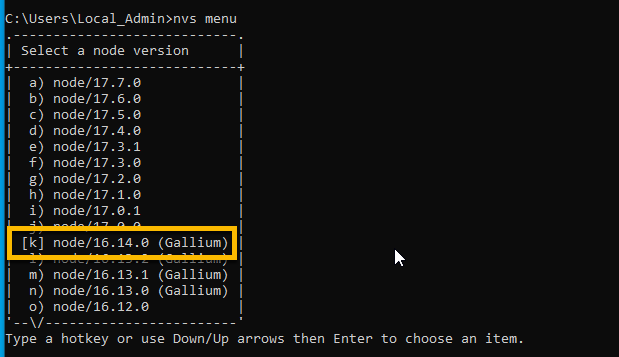

- Add and use the latedt RVEN Node Version i.e. 18

```
    nvs add 18
```
```
    nvs use 18
```
```    
    nvs link
```

- nvs link sets version 18 to default

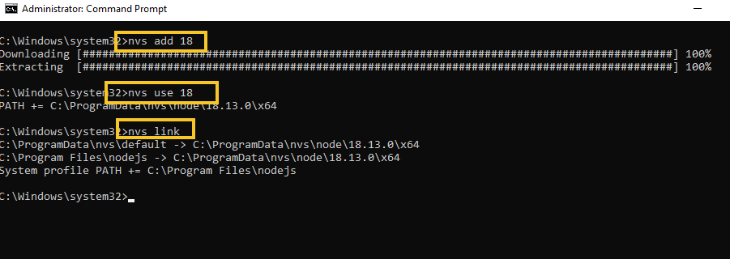


#### 5. Test from Windows command prompt:

```
node --version
```
```
npm --version
```

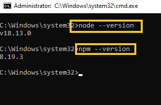

----
### 12. Install MySql for Windows 0:45
----
#### 1. Browse to: 

```
dev.mysql.com/downloads
```

- then click: MySql Installer for Windows


#### 2. Choose the MySQL version: 

<div class="notice-tip">
  <div class="notice-tip-header">
    Note: Do not choose the web version.
  </div>
</div>


#### 3. Click on "No thanks, just start my download"


- Then click on the downloaded .msi file to start 

- If you are presented with the follow, click No

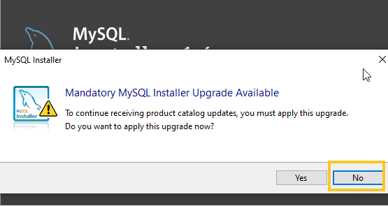

#### 4. Choose Setup Type: Custom


#### 5. Select Products 

- MySQL Server
- MySQL Workbench
- MySQL Shell
- Connector/ODBC x64
- Connector/J
- MySQL Documentation
- Samples and Examples

#### 6. Select from the "Available Products" column

- then click the +'s to reach the product 

- then click the right pointing arrow in the middle column

- your product will be shown in the Products to be Installed column.


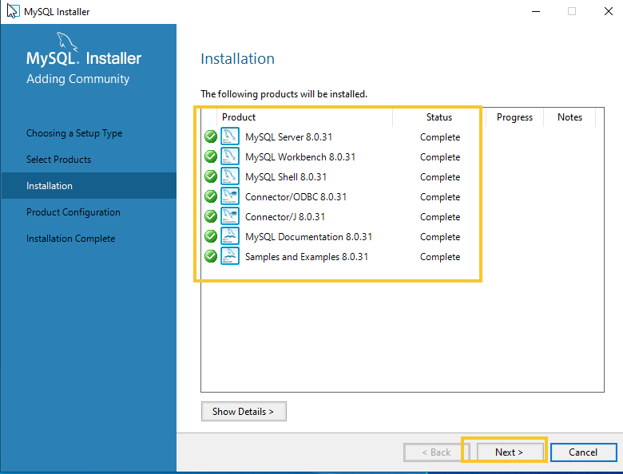

#### 7. Product Configuration


- Use the password: 

```
FormR!1234
```


<div class="notice-tip">
  <div class="notice-tip-header">
    Note: Remember to write your passwords in a safe place.
  </div>  
</div>


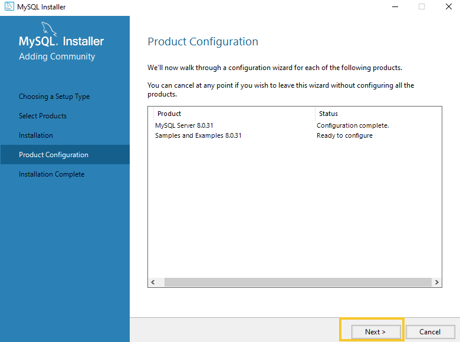

- Use the password: 

```
FormR!1234
```

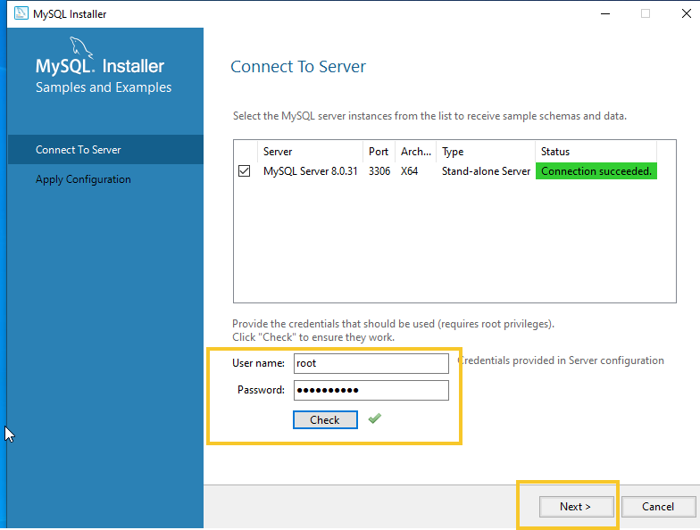

<div class="notice-tip">
  <div class="notice-tip-header">
    Note: Remember to write your passwords in a safe place.
  </div>  
</div>


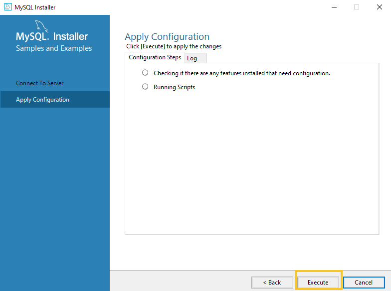


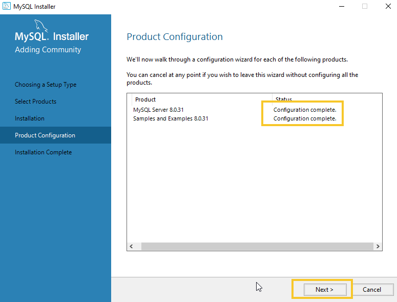

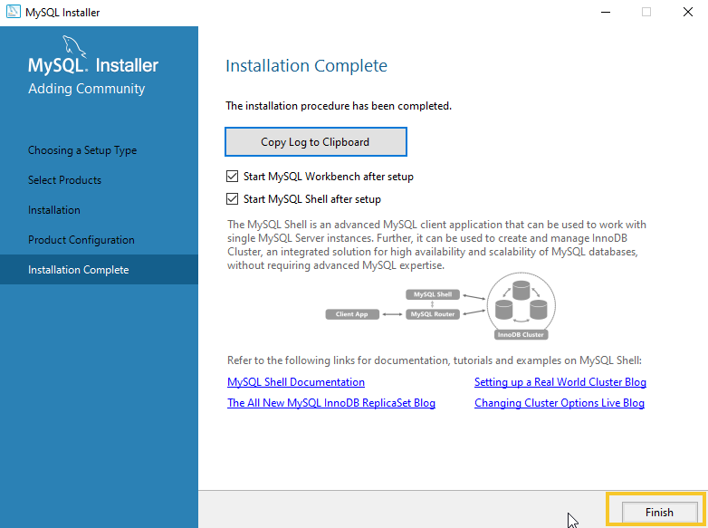


- MySQL Shell and MySQL WorkBench are automatically opened.


#### 8. Workbench

- Select the Workbench window and click Local Instance 


- Enter credentials

- Use the password: 

```
FormR!1234
```

- Click Save password in vault


<div class="notice-tip">
  <div class="notice-tip-header">
    Note: Remember to write your passwords in a safe place.
  </div>  
</div>

#### 9. Create and Grant Privileges to a new user account: nimdas with host %


<div class="notice-tip">
  <div class="notice-tip-header">
    Note: root@localhost has all rights and nimdas@% will have all rights.
  </div>  
</div>
 

- Open New Query tab


- Paste the following

```
CREATE USER 'nimdas'@'%' IDENTIFIED WITH mysql_native_password BY 'FormR!1234
';
GRANT ALL PRIVILEGES ON *.* TO 'nimdas'@'%';
SELECT user,authentication_string,plugin,host FROM mysql.user;
```


- Click the execute icon


#### 10. Select the MySql Shell window

- Enter:  
```
\connect root@localhost
```
- Password: 
```
FormR!1234
```
- Enter: Y to save password
```
Y
```


#### 11. Shell SHOW DATABASES

Enter: 

```
\sql SHOW DATABASES;  
```
- Don't forget the \ and ; 


----
### 13. Install Bitvise ssh client 0:05
----
#### 1. Install Bitvise from: 

```
https://bitvise.com/ssh-client-download
```


#### 2. Configure Bitvise

<div class="notice-tip">
  <div class="notice-tip-header">
    These 2 configuration changes will allow Bitvise to cleanly logout when you close your terminal and SFTP windows.
  </div>  
</div>


- Start Bitvise then click the Options tab then the check box "Logout when session activity is over".


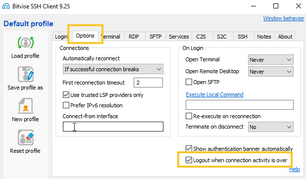

- Click on the Terminal Tab and choose "Always"

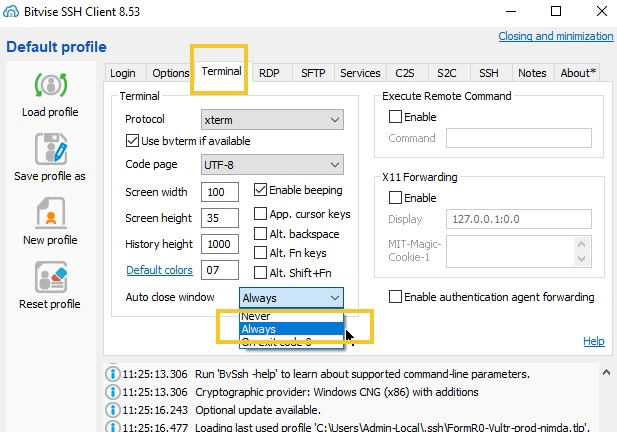

- Exit Bitvise to Save your changes to the Default profile.

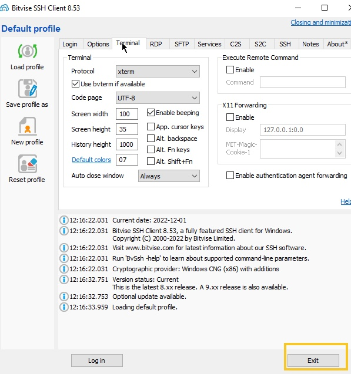

----
<div class="notice-success">
  <div class="notice-success-header">
    Congratulations! Your Developer Workstation is setup.
  </div>
</div>

----

 - After all installations on a new Windows 10 machine, 7 GB was added to Drive C:.

----
<!-- ------------------------------------------------------------------------- -->

<div class="page-back">

[BACK - formR Introduction](/_home.md.md)
</div><div class="page-next">

[Test NodeJS - NEXT](/Setup/fr0102_Test-Node.md)
</div>

<!-- ------------------------------------------------------------------------- -->
