<!-- ------------------------------------------------------------------------- -->

<div class="page-back">

[BACK - Build Workstation](/Setup/fr0101_Setup-Developer-Workstation.md)
</div><div class="page-next">

[Clone FRApps - NEXT](/Setup/fr0103_Clone-FR-Apps.md)
</div><div style="margin-top:35px">&nbsp;</div>

<!-- ------------------------------------------------------------------------- -->

## 1.2 Test NodeJS 1:00 <!-- {docsify-ignore} -->
<div class="notice-tip">
  <div class="notice-tip-header">
    Tip: <a href="../Setup/purposes/pfr0102_Test-Node.md" target="_blank">Link to Background and Purposes</a> 
  </div>  
</div>

<div class="notice-tip">
  <div class="notice-tip-header">
    Tip: <a href="https://discord.com/channels/928752444316483585/931216136853413958" target="_blank">Link to Discord for Your Comments</a> 
  </div>  
</div>

#### Introduction <!-- {docsify-ignore} -->
- The following steps create several basic node applications. 
- There are script, server, client and MySQL testing applications. Each has special requirements. You will create a folder structure and install the required packages. Everything will be installed in the repos/myProject folder. All activities will be done in VSCode.   

<details class="details-style">
    <summary class="summary-style">
More Info: Names, Caps, Picts, Code Copy
    </summary>
    <div class="popup">

- In this tutorial please be careful to use the Exact Spelling and Capitalization. You will be using Windows, Unix and GitBash command prompts. Improper captialization will cause commands to fail. Some examples are: Local_Admin, myProject, repos, remotes and .ssh.

- This documentation was produced in 2021-2022. You will experience differences in some of the pictures due to the changes made over time by the developers of the softwares and web sites that are used.

- We recommend that you copy and paste code snippets from the documentation into your workstation/server. This will reduce the errors caused by hand typing.
Hover over the snippet and click copy, then paste as appropriate.

</div>
</details>


----
### 1. Test the Node version 0:05
----
#### 1. Open VSCode

- In File Explorer navigate to C repos myProject, then double click on myProject.code-workspace.

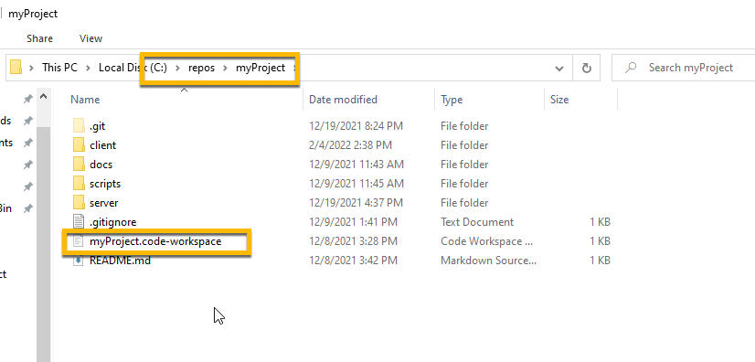

- In VSCode right click on the myProject folder and click on Open terminal


#### 2. Check Node version

- From terminal enter:

```
node --version 
```

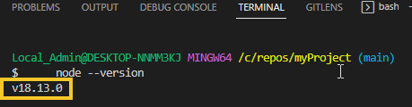

----
### 2. Create sub-folders in myProject 0:05
----
#### 1. Right-click on the myProject folder and create a new folder:

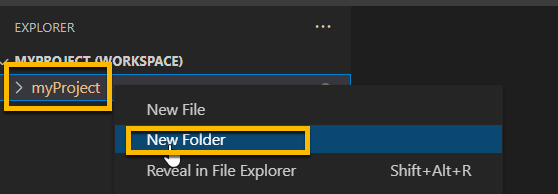

- Enter 

```
client
```

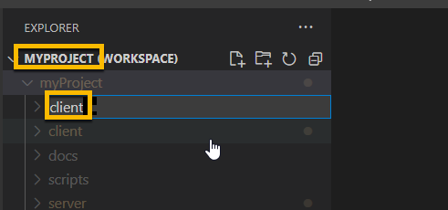

#### 2. Repeat step 1. for the following:

- Right click on myProject folder and create folders for:
```
  docs
```
```
  scripts
```
```
  server
```

#### 3. Right-click on the server folder and create a new folder:

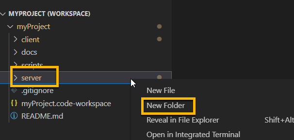

- Enter 
```
app01s
```

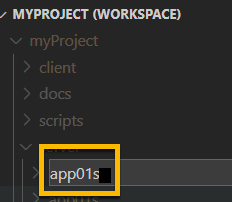

- Your new folders:


----
### 3. Create a new file, batch.js and run it with Nodejs. 0:10
----
#### 1. Right-click on the scripts folder, then click New File

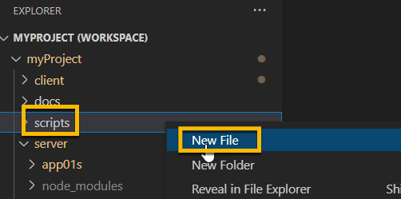

#### 2. In the blank area enter:

```
batch.js
```

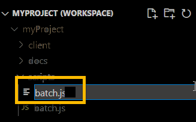

#### 3. Click on batch.js in the editor

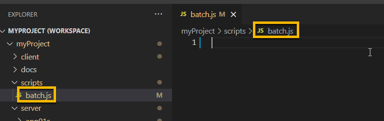

#### 4. Add the following code to batch.js:
<br/>

```js
console.log("Hello, World!");
```


#### 5. Right click on batch.js in the scripts folder and select Open in Integrated Terminal and click in the Terminal window and click in the Terminal window 


#### 6. In Terminal window enter:
<br/>

```
node batch.js
```


----
### 4. Create a new file, server.js in the server folder and run it with Nodejs. 0:10
----
#### 1. Right click on the server folder and Select Open in Integrated Terminal and click in the Terminal window and enter:


1. Enter: 

```
npm init
```

- Press enter 9 times to accept all defaults

- Enter "yes" when prompted "Is this OK?


2. Install express

```
npm install express
```

 

<div class="notice-tip">
  <div class="notice-tip-header">
    Note: In the previous steps we installed using npm (node package manager) which created and populated a new folder node_modules. This folder can be very large in size but does not need to be tracked in GitHub. Files in .gitignore will not be tracked in GitHub. 
  </div>  
</div>

#### 2. Create a new file in the myProject folder, .gitignore and add:


- Enter:

```
.gitignore
```

Open the .gitignore file

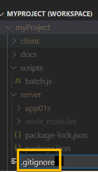

- Enter:

```
node_modules
```

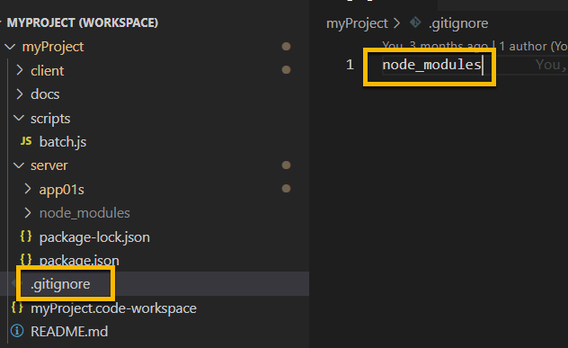

#### 3. Create a new file, server.js in the server/app01s folder

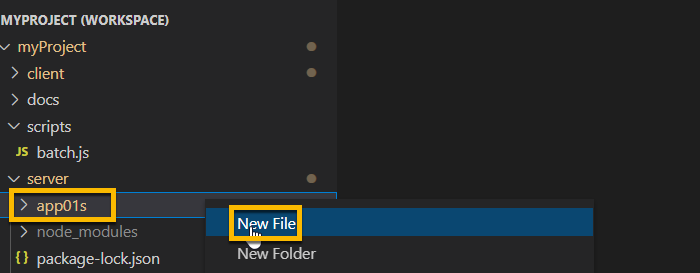

- Enter:

```
server.js
```

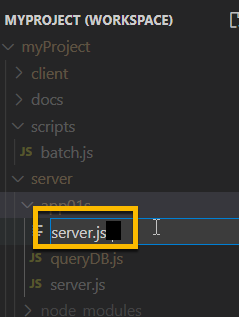


- Add this code:

```js
const express = require("express")
const app = new express();
app.use('/',myPage)

function myPage(req, res){
    var url = req.originalUrl;
    //send to browser
    res.send(`Hello, World from ${url} !`)
}

// set port
const PORT       =   process.env.PORT || 8080; 
// listen for requests
app.listen( PORT, () => {
    console.log(   `Server is running on port ${PORT}.` );
    } );

```


#### 4. Right click on the app01s folder and Select Open in Integrated Terminal and click in the Terminal window and click in the Terminal window


#### 5. Run server.js from the new terminal session

- Enter:

```
node server.js
```

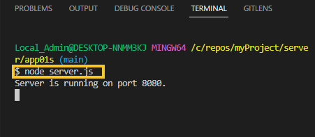


#### 6. Allow Access in Microsoft Firewall and click Private networks


#### 7. Terminal shows server running on port 8080


#### 8. Browse to:
<br/>

```
http://localhost:8080/myProject/server/app01s
```


#### 9. Push your changes to GitHub

1. Click the Source Control charm


2. Add Message:

```
Add Node App - batch.js
```


3. Commit

- Click on Commit button 

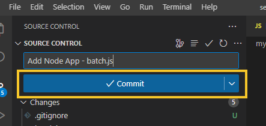

4. Sync

- Click on the Sync Changes button 

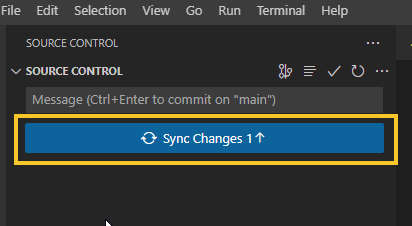

5. The following message may show the first time. 

- Click on: Ok, Don't show again


----
### 5. Create a basic react app in the client folder and run it with Nodejs. 0:10
----
#### 1. Right click in the - client - folder and select Open in Integrated Terminal and click in the Terminal window and click in the Terminal window


#### 2. Enter:

```
npm init
```

- Press enter 9 times to accept all defaults

- Enter "yes" when prompted "Is this OK?


#### 3. Create a React app:

```
npx create-react-app app01c
```


#### 4. Right click in the - client/app01c - folder and select Open in Integrated Terminal and click in the Terminal window and click in the Terminal window

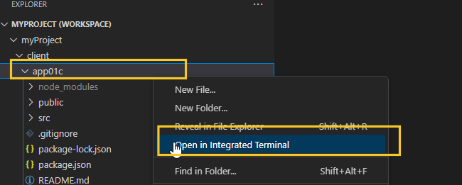

#### 5. Enter: 

```
npm start
``` 

<div class="notice-tip">
  <div class="notice-tip-header">
    Note: it takes several minutes for the React app to start up.
  </div>  
</div>


- Browse to:

```
localhost:3000
```


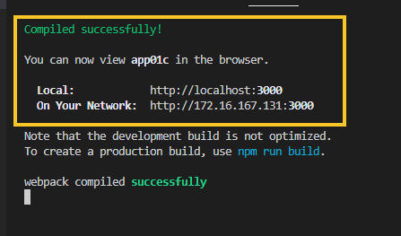

#### 6. Adjust package.json for React-Scripts 

<div class="notice-tip">
  <div class="notice-tip-header">
    Note: This prevents npm audit from returning development vulnerabilities list for react-scripts
  </div>  
</div>

- In VScode edit myProject/client/app01c package.json, 

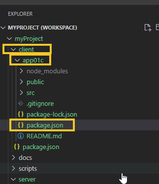

- Cut the following react-scripts line from the dependencies section of package.json

```
REMOVE This line: "react-scripts": "^5.0.1",
```

- Insert the following devdependencies section:

```js
  "devdependencies": {
    "react-scripts": "^5.0.1"
  },

```

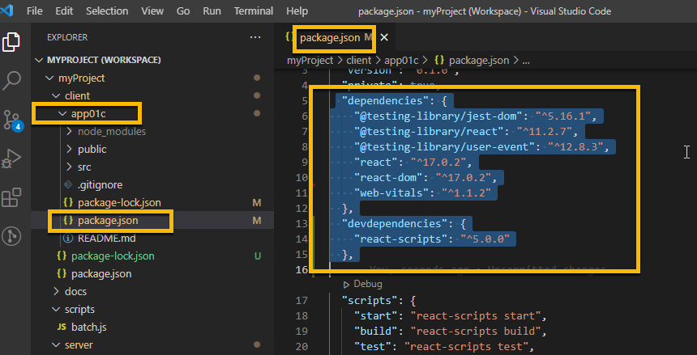

- Test by running npm audit. 

- From client/app01c folder, right click and click Open in Integrated Terminal and click in the Terminal window


- Test for vulnerabilities in production

```
npm audit --production
```
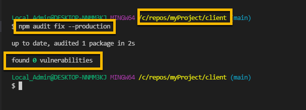


----
----
#### * Push your changes to Github *

1. Click the Source Control charm

2. Add description of your choice

3. Click the Commit button

4. Click the Sync Changes button to push to github
----

----
### 6. Create a Nodejs routine to access the local MySQL database and return information. 0:10
----
#### 1. Install Sequelize. 

<div class="notice-tip">
  <div class="notice-tip-header">
    Sequelize will be used to connect to and access information in MySQL. 
  </div>  
</div>


#### 2. Open a New Terminal

- Right click in the - server - folder and select Open in Integrated Terminal and click in the Terminal window


#### 3. Enter:

```
npm install --save sequelize
```


```
npm install --save mysql2
```


#### 4. Search for Mysql WorkBench and open it


#### 5. Right click on the icon and Pin to TaskBar


#### 6. In Workbench click on the Local Instance that was created when MySQL was installed


#### 7. In the query 1 window paste in:

```js
CREATE DATABASE practice
```
#### 8. Then click the execute icon


#### 9. Click on the Schemas tab, then the refresh icon and your new database, practice, will appear 


#### 10. From VSCode Explorer navigate to the folder server/app01s and create a new file, queryDB.js, then paste in the following code:

```js
const Sequelize = require("sequelize");
const sequelize = new Sequelize("practice", "root", "FormR!1234", 
{
  host: "localhost", 
  dialect: "mysql", 
});
 
// Step 1. CREATE TABLE 
//const SQLstr = "CREATE TABLE customers (id INT AUTO_INCREMENT PRIMARY KEY, name VARCHAR(255), address VARCHAR(255))"

// Step 2. SHOW TABLES 
//const SQLstr = "SHOW TABLES"

// Step 3. INSERT 1 ROW
//const SQLstr = "INSERT INTO customers (name, address) VALUES ('Company Inc', 'Highway 37')"

// Step 4. UPDATE 1 ROW 
//const SQLstr = "UPDATE customers SET address = 'Highway 40' where id = 1"

// Step 5. Create a Stored Procedure
//const SQLstr = "CREATE PROCEDURE sp_getcustomers() Select id, name,address from customers ;"

// Step 6. Execute a Stored Procedure
//const SQLstr = "Call sp_getcustomers"

//------------------------------------------------------------

runQuery();
async function runQuery() {
  try { 
  const values = await sequelize.query(SQLstr);
  console.log(values);
  } catch (error) {
    console.log(error);  
  }
}
```

#### 11. Review the Steps

- In queryDB.js each step 1 - 6 there is a 'const SQLStr..' line. 

- The symbol // is a comment. 

- For each step, one at a time, remove the comment on  the 'const SQLStr..' line, then go to the terminal.


#### 12. After the execution of a step

- Comment out the 'const SQLStr..' line for this step (//) and 

- uncomment the line in the next step (delete //)

#### 13. Repeat each time for all 6 steps. 

 <div class="notice-warning">
  <div class="notice-warning-header">
    Warning: Execute each step only once.
  </div>

- Be aware, if you execute the same step twice in a row you will get an error. 

- For example, Step 1. creates a table. If you run it a second time  You will get an error that tells you that the table already exists.

</div>

#### 14. Open a New Terminal

- Right click in the - server/app01s - folder and select Open in Integrated Terminal and click in the Terminal window and click in the Terminal window


#### 15. Uncomment Step 1 Create Table


#### 16. Enter:

```
node queryDB
```


#### 17. Check in Workbench that the customers table was created

- Under Schemas click the refresh icon

- open practice, then tables and you will see customers

- You have executed code to create a data table in MySQL


#### 18. Comment out "Create Table" and uncomment "Show Tables" then run 

```
node queryDB
```


#### 19. Comment out "Show Tables" and uncomment "Insert 1 Row" then run 

```
node queryDB
```

- You have executed code to insert information into the customers table


#### 20. Check Workbench - Insert

- Click on the Query1 tab

- Delete anything there

- Paste in:

```
SELECT * FROM practice.customers;
```

- Click the Execute icon

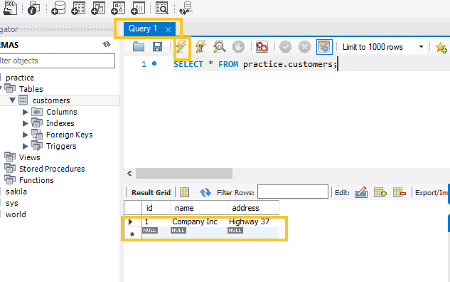

#### 21. Comment out "Insert 1 Row" and uncomment "Update 1 Row" then run 

```
node queryDB
```

- You have executed code to update information in the customers table


#### 22. Check Workbench - Update

- Click on the Execute icon for Query 1

- The address has changed from Highway 37 to 40


#### 23. Comment out "Update 1 Row" and uncomment "Create Stored Procedure" then run node queryDB

```
node queryDB
```

- A Store Procedure is code that is executed on the MySQL server


#### 24. Check Workbench - Create Stored Procedure

- Under Schemas click the refresh icon

- open StoreProcedures and you will see sp_getcustomers


#### 25. Comment out "Create Stored Procedure" and uncomment "Execute Stored Procedure" then run 

```
node queryDB
```


#### 26. Check Workbench - Create Stored Procedure

- Click on the Query1 tab

- Delete anything there

- Paste in:

```
CALL practice.sp_getcustomers();
```

- Click the Execute icon


#### 27. Reset MySQL to run these actions again

- Comment out "Execute Stored Procedure" step in queryDB.js

- Go to workbench

- Click on the Query1 tab

- Delete anything there

- Paste in:

```
Drop DATABASE practice;
```

- Click the Execute icon


----
----
#### * Push your changes to Github *

1. Click the Source Control charm

2. Add description of your choice

3. Click the Commit button

4. Click the Sync Changes button to push to github
----


----
<div class="notice-success">
  <div class="notice-success-header">
    Congratulations! You have successfully run the Node applications that test your development environment.
    </div>
</div>

----

<!-- ------------------------------------------------------------------------- -->

<div class="page-back">

[BACK - Build Workstation](/Setup/fr0101_Setup-Developer-Workstation.md)
</div><div class="page-next">

[Clone FRApps - NEXT](/Setup/fr0103_Clone-FR-Apps.md)
</div>

<!-- ------------------------------------------------------------------------- -->

