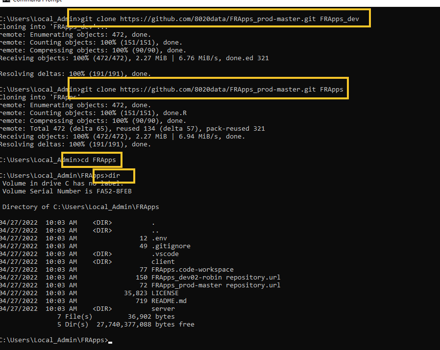
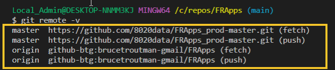
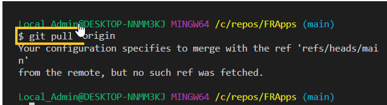
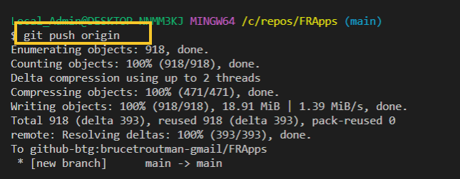
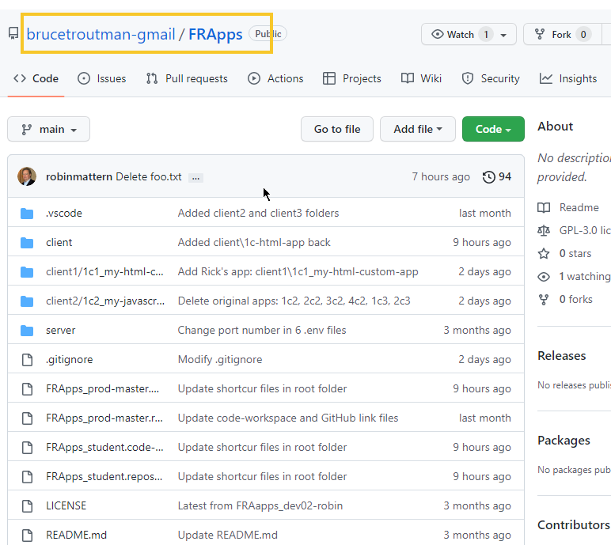
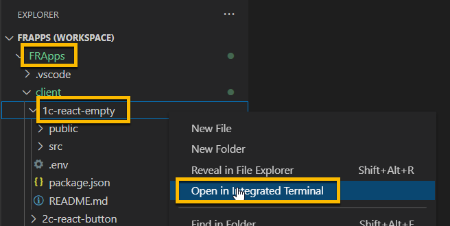
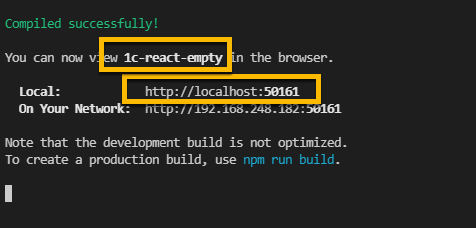
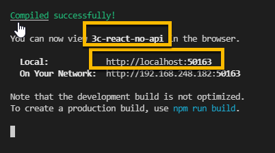
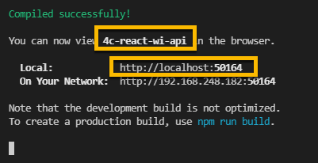

<!-- ------------------------------------------------------------------------- -->

<div class="page-back">

[BACK - Test NodeJS](/Setup/fr0102_Test-Node.md)
</div><div class="page-next">

[Custom FR Apps HTML - NEXT](/Setup/fr0104_Custom-FR-Apps-HTML.md)
</div><div style="margin-top:35px">&nbsp;</div> 
 
<!-- ------------------------------------------------------------------------- -->

## 1.3 Clone FR Apps 0:45
- [Purpose and Background](../Setup/purposes/pfr0103_Clone-FR-Apps.md)
- [Enter Comments in Discord](https://discord.com/channels/928752444316483585/931216956827250709)

#### Introduction  
- FR Apps is a collection of applications. The apps increase in complexity from simple through database access. 
- In this topic you will clone and test these basic applications on your local workstation.


#### Important note about names, capitalization, pictures and code copying
- In this tutorial please be careful to use the Exact Spelling and Capitalization. You will be using Windows, Unix and GitBash command prompts. Improper captialization will cause commands to fail. Some examples are: Local_Admin, myProject, repos, remotes and .ssh.
- This documentation was produced in 2021-2022. You will experience differences in some of the pictures due to the changes made over time by the developers of the softwares and web sites that are used.
- We recommend that you cut and paste code snippets from the Documentation into your workstation/server. This will reduce the errors caused by hand typing.


----


### 1 Clone FRApps Repository 0:05
----
1. Clone into the local repos folder using the Windows Command prompt

```
cd C:\repos
```
 


```
git clone https://github.com/8020data/FRApps_prod-master.git FRApps

cd FRApps

dir
```



2. Enter the following in the terminal. (It will open VSCode)

```
code FRApps.code-workspace
```

- If prompted, click "Yes I trust the authors".


 
3. Create FRApps in your github. 

- Browse to and login to your personal github account. (We created this in Step 1.1.5)

```
https://github.com/brucetroutman-gmail?tab=repositories
```


- Add a new repository in your personal github: FRApps


4. Using VSCode Connect your local FRApps to your personal github FRApps

- Right click on the server folder

- Click Open in Integrated Terminal, then 


- Show your current remotes: 8020data

```
git remote -v
```


- Change your remote to your personal github. 

    - change your=github-hostname to your (Your github host is found in the config file in the .ssh folder)
e.g. github-btg


    - change your-github-account-name to your github account name. e.g brucetroutman-gmail


```
git remote set-url origin your=github-hostname:your-github-account-name/FRApps
```


- Confirm that your remotes have changed

```
git remote -v
```



6. Pull from your personal github FRApps repo to your local FRApps repo

```
git pull
```



7.  Push from your local FRApps repo to personal github FRApps repo

```
git push
```




8. Comfirm the transfer from github




9. Update author package.json


----


----
### 2. Install Node modules  0:15
----
1. Right click on the client folder

2. Click Open in Integrated Terminal, then 


```
npm install
```


3. Test for production vulnerabilities

```
npm audit --production
```


4. Right click on the server folder

5. Click Open in Integrated Terminal, then 


```
npm install 
```


----
 ### 3. Run Client 2c-React-Empty application 0:05
----

1. Right click on the client/2c-React-Empty folder
2. Click Open in Integrated Terminal, then 

 

```
npm start
```


- If you are prompted, click Allow Access





----
 ### 4. Run Client 3c-React-Button application 0:05
----

1. Right click on the client/3c-React-Button folder
2. Click Open in Integrated Terminal, then 

 

```
npm start
```


- Click the Like button.


----
 ### 5. Run Client 4c-react-app-no-api Application 0:05
----

1. Right click on the client/4c-react-app-no-api folder
2. Click Open in Integrated Terminal, then 

 

```
npm start
```
 




3. Click Invoices, then Santa Monica


----
 ### 6a. Run Server 5s-react-app-wi-api application 0:05
----

1. Right click on the server/5s-react-app-wi-api folder 
####  Note: server folder  client folder
2. Click Open in Integrated Terminal, then 

 

```
npm start
```


3. Browse to

```
http://localhost:50115/invoices
```


#### Note: Keep this step 6a running when you do step 6b (next step)

----
 ### 6b. Run Client 5c-react-app-wi-api application 0:05
----

#### Note: Be sure step 6a is running
<br/>

1. Right click on the client/5c-react-app-wi-api folder
####  Note: client folder NOT server folder
2. Click Open in Integrated Terminal, then 

 

```
npm start
```





3. Click Invoices, then Ocean Avenue


----
#### Congratulations! You have cloned and run the FRApps successfully to your local workstation.
----

<!-- ------------------------------------------------------------------------- -->

<div class="page-back">

[BACK - Test NodeJS](/Setup/fr0106_Test-Node.md)
</div><div class="page-next">


[Custom FR Apps HTML - NEXT](/Setup/fr0104_Custom-FR-Apps-HTML.md)
</div>

<!-- ------------------------------------------------------------------------- -->
