<!-- ------------------------------------------------------------------------- -->

<div class="page-back">

[BACK - Clone First React Apps](/Setup/fr0102_Clone-First-React-Apps.md)
</div><div class="page-next">

[Harden Ubuntu - NEXT](/Setup/fr0302_Setup-Hardening-Ubuntu.md)
</div><div style="margin-top:35px">&nbsp;</div>

<!-- ------------------------------------------------------------------------- -->

## 2.1 Create Vultr Ubuntu 0:25
- [Purpose and Background](../Setup/purposes/pfr0301_Setup-Vultr-Ubuntu.md)
- [Enter Comments in Discord](https://discord.com/channels/928752444316483585/931217076885008495)

#### Introduction
- In order to test our FormR apps on the Internet  we will create an Ubuntu server on the cloud provider, Vultr.com. 
- Vultr costs under $10 per month. 
- Please use the following link when you begin:

```
https://www.vultr.com/?ref=8778592
```

#### Important note about names, capitalization, pictures and code copying
- In this tutorial please be careful to use the Exact Spelling and Capitalization. You will be using Windows, Unix and GitBash command prompts. Improper captialization will cause commands to fail. Some examples are: Local_Admin, myProject, repos, remotes and .ssh.
- This documentation was produced in 2021-2022. You will experience differences in some of the pictures due to the changes made over time by the developers of the softwares and web sites that are used.
- We recommend that you cut and paste code snippets from the Documentation into your workstation/server. This will reduce the errors caused by hand typing.


----
### 1. Create New Ubuntu Instance  0:10
----
1. Signin or create an account on vultr.com (Note the ref=8778592 below tells Vultr and us that you are doing the FormR tutorial.)

- Browse to:

```
https://www.vultr.com/?ref=8778592
```

2. Deploy New Server 


3. Choose Server: Cloud Compute

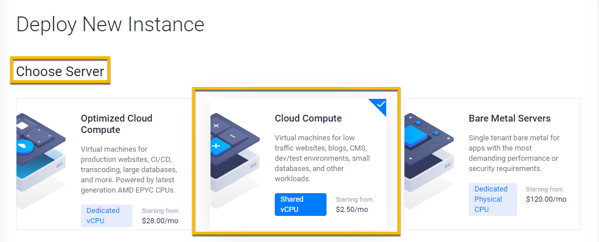

4. CPU and Storage


5. Server Location


6. Server Image: Ubuntu choose the highest version for the FormR tutorial.

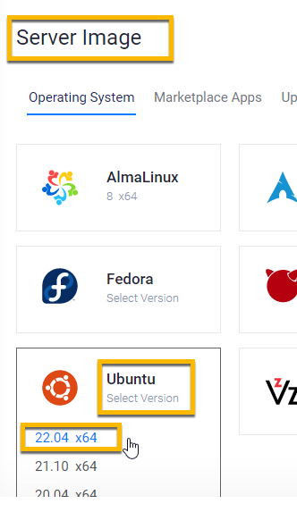

7. Server Size: 25GB

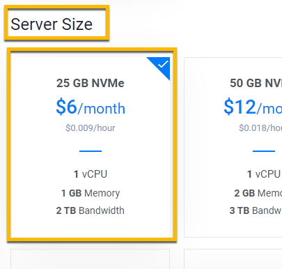

8. Add SSH Key
    - Select your Vultr public key in C:\users\Local_Admin\\.ssh


    - Open the file in Notepad and copy the key 


    - Paste the key value into the Vultr SSH Key box and give the key a name.


9. Auto Backup = Off

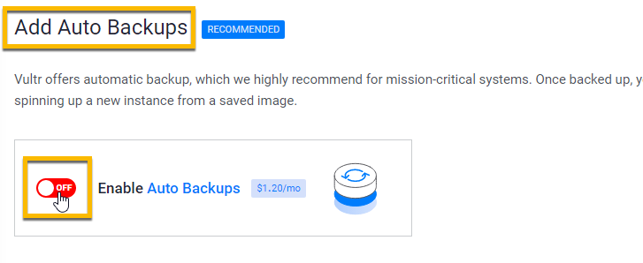

10. Server Hostname and Label: Vultr-FormR0 for both

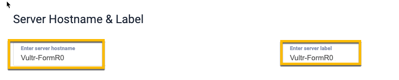


11. Click Deploy Now


- Installing


----
### 2. Use Bitvise access Vultr-FormR0  0:15
----
1. Open Bitvise

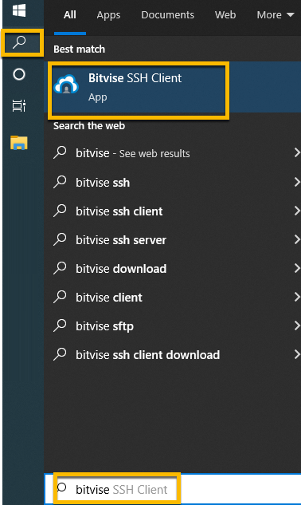

2. Click New Profile

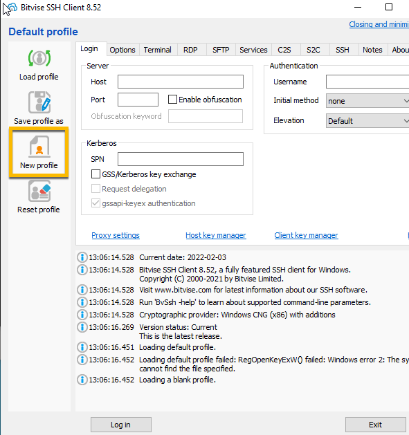

3. Enter new profile name

```
Vultr-FormR0-root.tlp
```

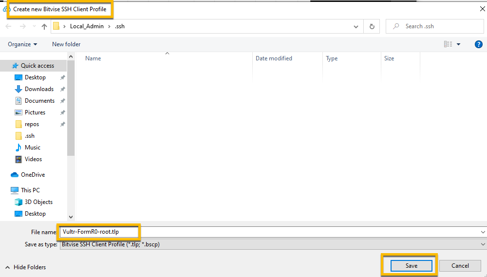

4. Fill in the following:

```
Host = Vultr-FormR0 IP Address (copy from Vultr web page)

Port = 22

Username = root

Initial Method = password

Click Checkbox - Store encrypted password in profile

Password = Vultr-FormR0 root password (copy from Vultr web page)

```

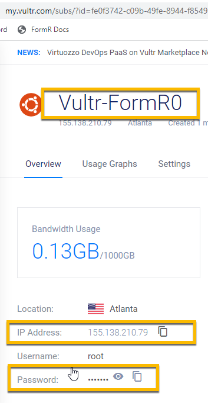

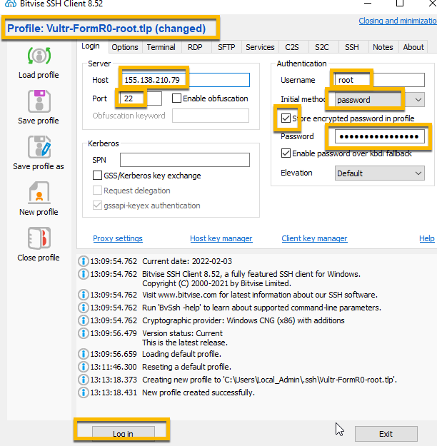

5. Click Login

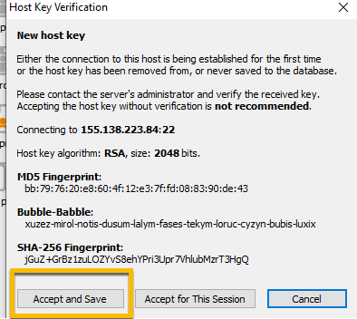

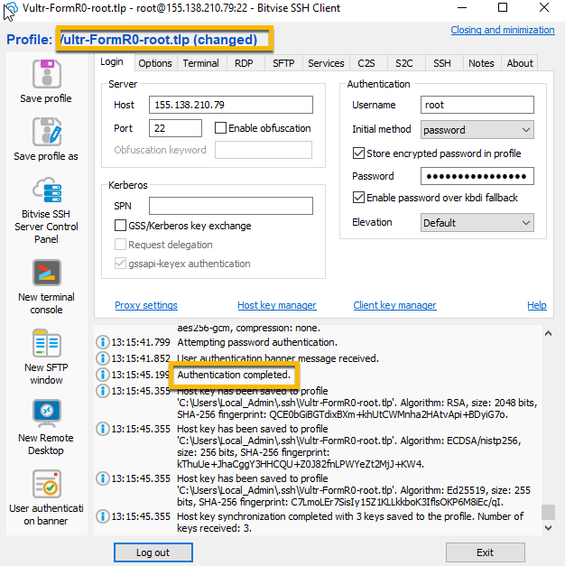

6. Important-- Save Profile

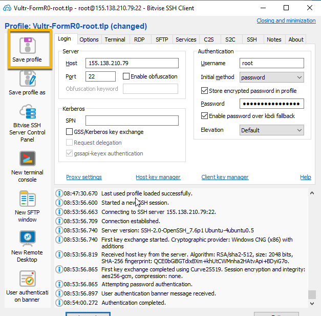

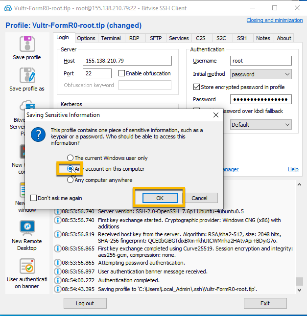


6. Click New terminal console button

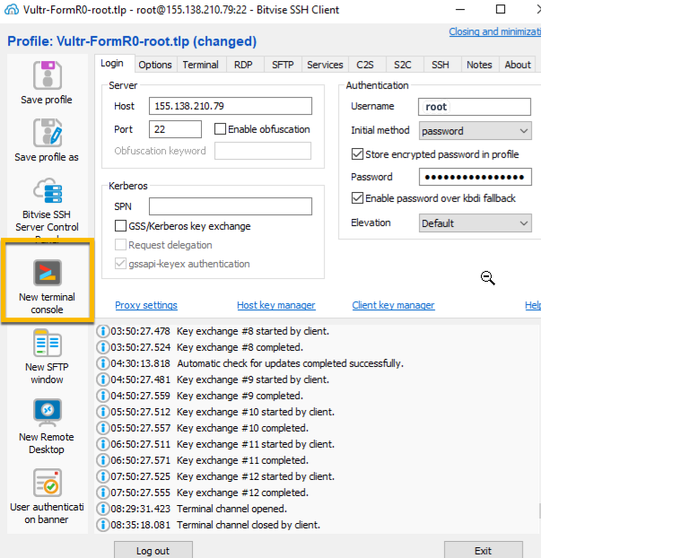

7. You will see the Welcome screen for Ubuntu and the command prompt:

    root@Vultr-FormR0:~#

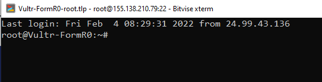

----
#### Congratulations! You have created your Ubuntu server on Vultr.
----


<!-- ------------------------------------------------------------------------- -->

<div class="page-back">

[BACK - Clone First React Apps](/Setup/fr0102_Clone-First-React-Apps.md)
</div><div class="page-next">

[Harden Ubuntu - NEXT](/Setup/fr0302_Setup-Hardening-Ubuntu.md)
</div>


