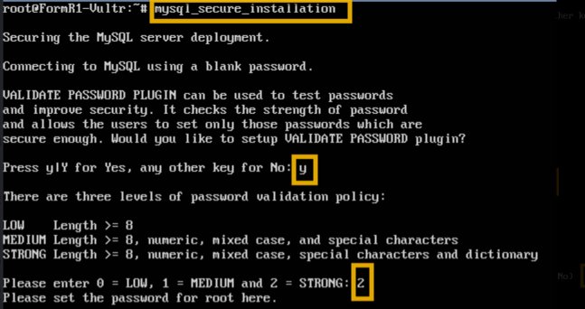
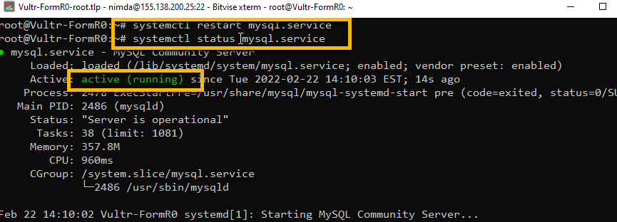
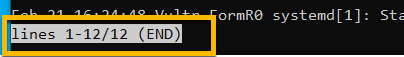
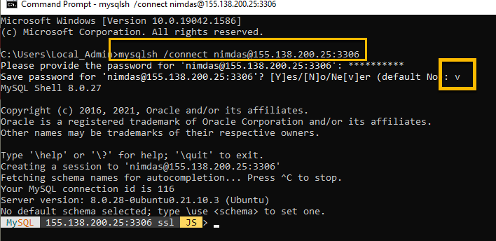
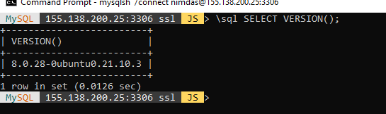
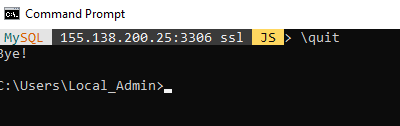

<!-- ------------------------------------------------------------------------- -->

<div class="page-back">

[BACK - Install App Server ](/Setup/fr0304_Setup-App-Server-Ubuntu.md)
</div><div class="page-next">

[Website SSL - NEXT](/Setup/fr0306_Setup-Website-SSL-Ubuntu.md)
</div><div style="margin-top:35px">&nbsp;</div>

<!-- ------------------------------------------------------------------------- -->

## 2.5 Install Data Server 0:25 <!-- {docsify-ignore} -->
- [Purpose and Background](../Setup/purposes/pfr0305_Setup-Data-Server-Ubuntu.md)
- [Enter Comments in Discord](https://discord.com/channels/928752444316483585/932678480863305770)

#### Introduction
- MySql will be your database on your server.
- In this step you will install and secure it.
- You will test your access from your local workstation.

#### Important note about names, capitalization, pictures and code copying
- In this tutorial please be careful to use the Exact Spelling and Capitalization. You will be using Windows, Unix and GitBash command prompts. Improper captialization will cause commands to fail. Some examples are: Local_Admin, myProject, repos, remotes and .ssh.
- This documentation was produced in 2021-2022. You will experience differences in some of the pictures due to the changes made over time by the developers of the softwares and web sites that are used.
- We recommend that you cut and paste code snippets from the Documentation into your workstation/server. This will reduce the errors caused by hand typing.

----
### 1. Restart your Vultr VM and Login 0:05

----
1. Open Bitvise and Load profile for Vultr-formR0-root and click Login


2. Click New terminal console


3. Enter:

```
reboot
```


- Close the Terminal window and wait for Bitvise to automatically login

4. From Bitvise click New terminal console


#### Note: To paste commands into the terminal, right-click at the terminal prompt 

----
### 2. Install MySQL 0:05
----
1. Install MySQL

```
apt-get install mysql-server

(Enter Y to continue, if asked)

```


2. Check installation
```
mysql --version
```


----
### 3. Secure MySQL 0:10
----
1. Lock down MySQL - Running this script will ask you

```
mysql_secure_installation
```

      - Add VALIDATE PASSWORD PLUGIN: Yes
      - Enter a "password validation policy level": 2
      - Enter a password for the user, root, to login to MySQL: formR!1234
      - Enter to save password: Yes
      - Remove anonymous users? Yes
      - Disallow root login remotely? No (Yes on a production server)
      - Remove test database and access to it? No 
      - Reload privilege tables now? Yes





2. Allow remote access to MySQL 

```
nano /etc/mysql/mysql.conf.d/mysqld.cnf

Change line:         bind-address = 127.0.0.1
to:                  bind-address = 0.0.0.0
```


3. Save the file by pressing Ctrl-X, then Y and then Enter to save the file name.

4. Restart mysql and comfirm its running

```
systemctl restart mysql.service

systemctl status mysql.service
```



- Note: If you get a "lines ... (END)" message, press ctrl-c then Enter to continue



5. Open firewall rule for port 3306

```
ufw allow 3306/tcp

ufw status   
```


6. Create and Grant Privileges to user account: nimdas with host %
(Note: root@localhost has all rights and nimdas@% will have all rights) 

7. From the  New terminal console prompt enter:

```
mysql -p
```

8. Enter : the root password -> formR!1234

```
password: formR!1234
```

#### !! Remember to write your passwords in a safe place !!
----

9. Enter the following from the mysql prompt:

```js
CREATE USER 'nimdas'@'%' IDENTIFIED WITH mysql_native_password BY 'formR!1234';

GRANT ALL PRIVILEGES ON *.* TO 'nimdas'@'%';

SELECT user,authentication_string,plugin,host FROM mysql.user;
```


10. Exit mysql
```
mysql> \quit
```


11. Stop, Start and check status of MySQL
```
systemctl stop mysql
systemctl start mysql
systemctl status mysql.service
```


- Note: If you get a "lines ... (END)" message, press ctrl-c then Enter to continue


----
### 4. Login as nimdas remotely from your local PC with MySQL Shell.  0:05
----
1. From Windows command prompt enter the following: (Use your Vultur server IP address)


```
mysqlsh /connect nimdas@xxx.xxx.xxx.xxx:3306

Enter the password formR!1234

Enter v to never save the password
```



2. Check Version. From the mysql command prompt enter the following:

```js
\sql SELECT VERSION();
```


 
3. Exit mysqlsh. From the mysql command prompt enter the following:

```
\quit
```


----
#### Congratulations! You have installed a Database server on your Ubuntu server.
----

<!-- ------------------------------------------------------------------------- -->

<div class="page-back">

[BACK - Install App Server ](/Setup/fr0304_Setup-App-Server-Ubuntu.md)
</div><div class="page-next">

[Website SSL - NEXT](/Setup/fr0306_Setup-Website-SSL-Ubuntu.md)
</div>

<!-- ------------------------------------------------------------------------- -->
